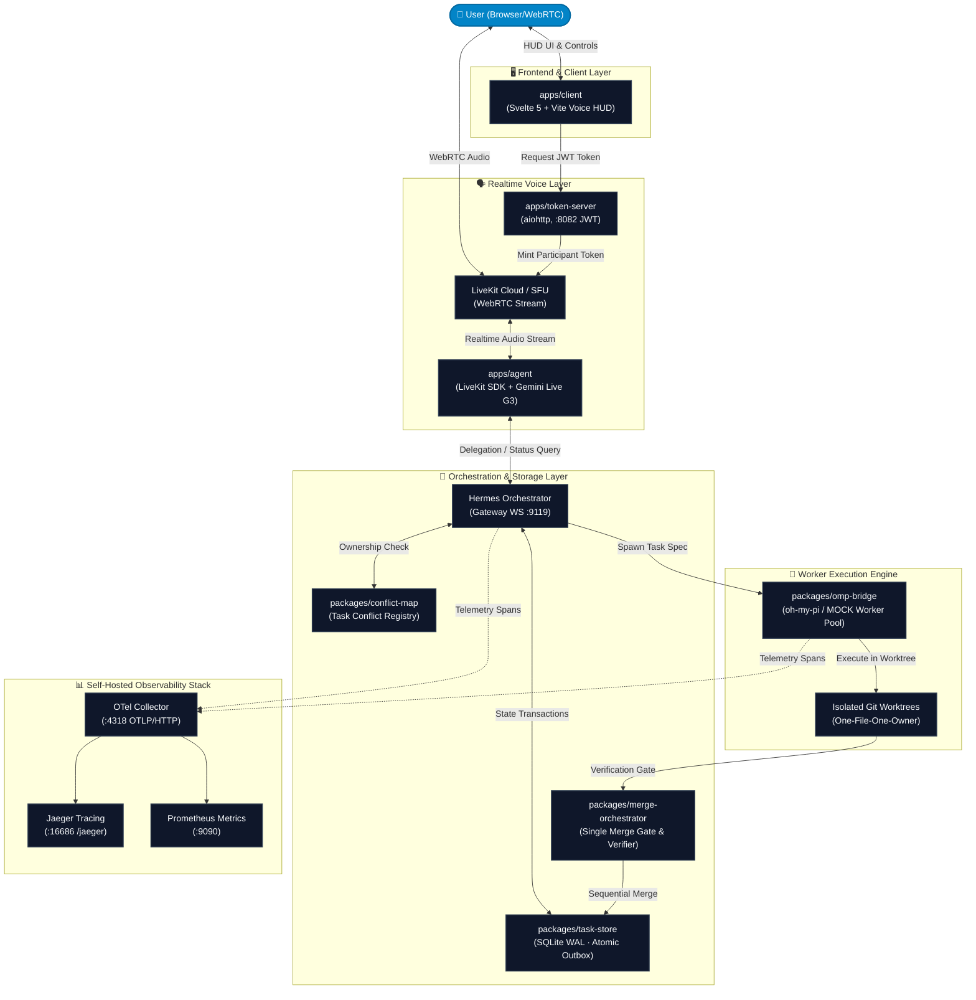

# Shorekeeper

Voice-first multi-agent AI assistant platform. A realtime voice agent (LiveKit + Gemini Live) serves as the front interface, Hermes acts as the orchestrator, and oh-my-pi (omp) as coding workers — all coordinated through a SQLite WAL task store with self-hosted observability (OpenTelemetry + Jaeger + Prometheus).

> Hard rule: all dependencies & APIs are **free** (zero subscriptions); LiveKit Cloud free tier with a hard cap.

## Key Features

- **Realtime voice agent** — LiveKit Agents SDK + Gemini Live API, interruption handling, session resumption, proactive notifications via outbox.
- **Multi-agent delegation** — spawn omp workers (or mock workers for fast execution), controlled parallelism, task conflict detection, retry.
- **Crash-resilient task store** — SQLite WAL single-writer, atomic outbox, task status survives restarts.
- **End-to-end observability** — OTLP traces → Jaeger, metrics → Prometheus, stack up/down in one command.
- **Quality evaluation** — YAML golden set + rubric, shell quality gates (exit-0) per phase.

## Architecture



Flow summary: the user speaks to the client → media streams via LiveKit Cloud to `apps/agent` → the agent processes it with Gemini Live; work tasks are delegated through `omp-bridge` to oh-my-pi workers (production uses a mock worker for fast execution with zero Hermes dependency), results land in the task store; the Hermes orchestrator pushes/claims tasks over WS. All production components bind `127.0.0.1` — public access goes exclusively through Nginx/domain.

## Stack

| Layer | Technology |
|---|---|
| Voice agent | Python 3.10+, LiveKit Agents SDK, Gemini Live API (`uv` per-app, not a workspace) |
| Client | Svelte 5 + Vite + TypeScript |
| Packages | Node ESM (pnpm workspaces), better-sqlite3 (SQLite WAL), zod |
| Token server | Python aiohttp (LiveKit JWT) |
| Observability | OpenTelemetry Collector, Jaeger all-in-one, Prometheus (Docker Compose) |
| Quality | vitest, eslint + prettier, ruff, pytest, exit-0 quality gates |

## Repository Layout

```
apps/
  agent/          # LiveKit voice agent (Python): Gemini Live, LLM bridge, notifications
  client/         # Svelte 5 UI: voice orb, recorder, model/voice picker
  token-server/   # LiveKit JWT endpoint (aiohttp)
packages/
  contracts/      # handoff-contract JSON/zod — source of truth for cross-component schema
  omp-bridge/     # oh-my-pi integration: worker spawn, mock worker, timeout, error mapping
  task-store/     # SQLite WAL: task status, atomic outbox, single-writer
  conflict-map/   # task conflict detection
  merge-orchestrator/ # single merge gate for multi-worker results
  observability/  # OTel tracing/metrics helpers
scripts/
  gates/          # per-phase quality gates (exit-0 = pass)
  e2e/            # E2E harness + smoke tests (parallel, conflict, prod)
  eval/           # golden set runner + linter
  otel/           # observability stack up/down
  ops/            # online DB backup/restore
tests/
  unit/ integration/ e2e/   # nested-repo fixtures bootstrapped deterministically
docs/
  adr/            # decision records (layout, omp transport, merge policy, observability)
  agents/         # persona prompts: SOUL, FRONT_AGENT, VOICE_MODE, etc.
  golden-set/     # golden test cases (YAML)
  runbooks/
```

## Getting Started

Prerequisites: Node.js ≥ 22, pnpm ≥ 9, `uv` + Python ≥ 3.10, Docker + Compose v2 (for observability).

```bash
# TS workspace
pnpm install
pnpm -r build
pnpm -r lint          # warning = failure
pnpm -r test

# Python agent
uv sync --project apps/agent
uv run --project apps/agent pytest -q apps/agent/tests
uv run --project apps/agent ruff check .

# observability stack (localhost-bound)
bash scripts/otel/up.sh
bash scripts/otel/down.sh

# smoke & gates
bash scripts/e2e/smoke-omp.sh        # single-task delegation (mock worker)
bash scripts/e2e/smoke-parallel.sh   # 3 parallel tasks
bash scripts/gates/gate-fase1.sh     # PHASE 1 GATE (exit 0)
```

For VPS deployment details (tight 3.6 GB RAM budget, systemd, ports): see [docs/DEPLOYMENT.md](docs/DEPLOYMENT.md).

## Configuration

Copy `.env.example` → `.env.local` (under `apps/agent/`) and fill in your LiveKit/Gemini credentials. `.env*` files never enter git. The production daemon uses the mock worker (`OMP_BRIDGE_MOCK=1`) by default.

## Documentation

| Document | Contents |
|---|---|
| [docs/ARCHITECTURE.md](docs/ARCHITECTURE.md) | System design & C4 diagrams |
| [docs/PRD.md](docs/PRD.md) | Product requirements |
| [docs/api.md](docs/api.md) | API contracts & handoff schema |
| [docs/DEPLOYMENT.md](docs/DEPLOYMENT.md) | WSL → VPS deployment guide |
| [docs/BLOCKERS.md](docs/BLOCKERS.md) | Open technical blockers (OMP-001, etc.) |
| [docs/HANDOFF_DESIGN.md](docs/HANDOFF_DESIGN.md) | Multi-device handoff design |
| [docs/EDGE-CASES.md](docs/EDGE-CASES.md) | Edge case catalog (E01–E33) |
| [docs/observability.md](docs/observability.md) | Tracing & metrics |
| [docs/adr/](docs/adr/) | Architecture decision records |
| [AGENTS.md](AGENTS.md) | Working conventions & quality gate commands |

## Credits

Built by [Schnee111](https://github.com/Schnee111).
