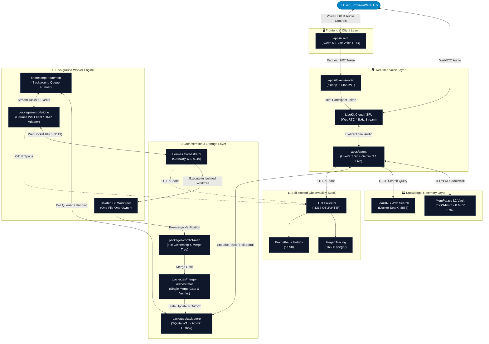

# Shorekeeper 🦋

[-emerald?style=flat-square)](scripts/gates/)
[](docs/ARCHITECTURE.md)
[](LICENSE)
[](#guiding-principles)

> **Shorekeeper** is a production-grade, voice-first multi-agent autonomous engineering platform. Featuring a real-time WebRTC conversational interface (LiveKit + Gemini Live), a central intelligent orchestrator (Hermes Agent Gateway), and asynchronous worker execution engines (oh-my-pi / omp) — unified by an atomic SQLite WAL task store, cross-wing semantic memory (MemPalace L2), and full self-hosted telemetry (OpenTelemetry + Jaeger + Prometheus).

---

## 🌟 Guiding Principles & Highlights

- **Zero-Cost Sovereign Stack:** 100% built on free tiers and open self-hosted software. No paid subscription APIs.
- **Voice-First Natural Interaction:** Sub-second streaming audio over WebRTC with Gemini 3.1 Flash Live, native interruption recovery, and prewarmed worker pools for instant room entry.
- **Substantive Voice Delivery:** Voice agents communicate actual, substantive findings and findings digests rather than empty status stubs.
- **Persistent Semantic Recall:** Integrated with MemPalace L2 over JSON-RPC 2.0 (`POST /mcp`), recalling historical ADRs, project taxonomy, and user preferences in under 300 ms.
- **Real Hermes WS Execution:** Asynchronous background tasks are dispatched to the live Hermes WebSocket gateway (`ws://127.0.0.1:9119/api/ws`), executing live bash scripts, git operations, and code reviews.
- **Crash-Resilient Task Store:** SQLite WAL with single-writer architecture, atomic outbox dispatching, and deterministic deduplication surviving restarts.
- **Granular Git Engineering Pipeline:** Strict autopilot loops: `Issue -> Feature Branch -> Granular Commits -> Test Gates -> PR -> Rebase Merge`.

---

## 🏗️ Architecture



---

## 📦 Monorepo Structure

```text
shorekeeper/
├── apps/
│   ├── agent/             # Python (uv): LiveKit Gemini 3.1 Live agent & MCP connectors
│   ├── client/            # Svelte 5 + Vite: Cyber-anime Voice HUD & WebRTC client
│   └── token-server/      # Python aiohttp: LiveKit JWT generation service (:8082)
├── packages/
│   ├── contracts/         # Zod schemas for task handoff, events, and records
│   ├── omp-bridge/        # Hermes WS client, task daemon, & stream token aggregator
│   ├── task-store/        # SQLite WAL task storage, atomic outbox, and state machine
│   ├── conflict-map/      # File-level concurrency protection & pre-spawn conflict checks
│   ├── merge-orchestrator/# Sequential merge verifier for background worktrees
│   └── observability/     # OpenTelemetry tracing helpers and privacy sanitizers
├── scripts/
│   ├── gates/             # Deterministic quality gate test runners (exit-0 requirement)
│   ├── e2e/               # End-to-end multi-agent integration & real-world stress suites
│   ├── eval/              # Golden set evaluation harness (20 YAML scenarios)
│   ├── otel/              # Observability stack bootstrap (Jaeger, Prometheus, Collector)
│   └── ops/               # Online database backup and atomic recovery scripts
├── deploy/                # Systemd service units & production environment templates
└── docs/                  # Architecture specs, PRDs, ADRs, runbooks, and golden sets
```

---

## 🛠️ Tech Stack & Prerequisites

| Subsystem | Technologies & Frameworks |
|---|---|
| **Voice Agent** | Python 3.11+, LiveKit Agents SDK v1.6+, Google Gemini Live (`gemini-3.1-flash-live-preview`), `uv` |
| **Client UI** | Svelte 5 (Runes), Vite, TypeScript, TailwindCSS, WebRTC Audio API (48kHz) |
| **Orchestration** | Node.js ≥ 22 (ESM), pnpm workspaces, Hermes Agent Gateway (WebSocket RPC) |
| **Data & Memory** | SQLite (WAL mode, `better-sqlite3`), MemPalace L2 (JSON-RPC 2.0 MCP server) |
| **Observability** | OpenTelemetry Collector, Jaeger UI, Prometheus (Docker Compose) |
| **Testing & Quality** | Vitest, ESLint, Prettier, Pytest, Ruff |

---

## 🚀 Quickstart & Development

### 1. Prerequisites
Ensure you have installed:
- **Node.js** ≥ 22.x & **pnpm** ≥ 9.x
- **Python** ≥ 3.11 & **uv** package manager
- **Docker & Docker Compose** v2 (for self-hosted observability & SearXNG)

### 2. Installation
```bash
# Clone the repository
git clone https://github.com/Schnee111/shorekeeper.git
cd shorekeeper

# Install TypeScript workspace dependencies & build packages
pnpm install
pnpm -r build

# Sync Python environment dependencies
uv sync --project apps/agent
```

### 3. Environment Setup
Create the local environment files based on the provided templates:
```bash
cp apps/agent/.env.example apps/agent/.env.local
```
Fill in the following required variables in `apps/agent/.env.local`:
- `LIVEKIT_URL`, `LIVEKIT_API_KEY`, `LIVEKIT_API_SECRET`
- `GEMINI_API_KEY` (or `GOOGLE_API_KEY`)
- `MEMPALACE_MCP_HTTP_ENDPOINT` (default: `http://127.0.0.1:8767/mcp`)
- `MEMPALACE_MCP_HTTP_TOKEN`
- `HERMES_WS_URL` (default: `ws://127.0.0.1:9119/api/ws`)

### 4. Running Quality Gates & Tests
Before committing changes, execute the non-negotiable verification gates:
```bash
# Workspace lint & unit test verification
pnpm -r lint
pnpm -r test

# Python agent linting & test suite
uv run --project apps/agent ruff check .
uv run --project apps/agent pytest -q apps/agent/tests

# End-to-End verification suites
bash scripts/gates/gate-fase1.sh
bash scripts/gates/gate-fase2.sh
node scripts/e2e/comprehensive-test.mjs
```

---

## ⚙️ Production Operations (Systemd)

In a live production environment (e.g. Linux VPS under tight RAM budgets), the components are isolated and managed via dedicated systemd services:

```bash
# Restart voice agent and background daemon
sudo systemctl restart shorekeeper-agent.service
sudo systemctl restart shorekeeper-daemon.service

# Inspect service logs
journalctl -u shorekeeper-agent.service -f
journalctl -u shorekeeper-daemon.service -f
```

---

## 📚 Documentation Index

- [Architecture & C4 Diagrams](docs/ARCHITECTURE.md) — Comprehensive architectural topology and dataflows.
- [Product Requirements Document (PRD)](docs/PRD.md) — Feature specifications and phase acceptance criteria.
- [API & Schema Contracts](docs/api.md) — Zod schemas, task structures, and WebSocket contracts.
- [Deployment Runbook](docs/DEPLOYMENT.md) — Linux VPS provisioning, memory budgeting, and reverse proxy setup.
- [Observability Guide](docs/observability.md) — Jaeger distributed tracing, OTel spans, and metrics instrumentation.
- [Engineering Conventions (AGENTS.md)](AGENTS.md) — Living developer guide and Git autopilot workflow rules.
- [Architecture Decision Records (ADRs)](docs/adr/) — Technical trade-off logs and architectural decisions.

---

## 👤 Author & Maintainer

Engineered with devotion by [**Muhammad Daffa Ma'arif (Schnee111)**](https://github.com/Schnee111).
