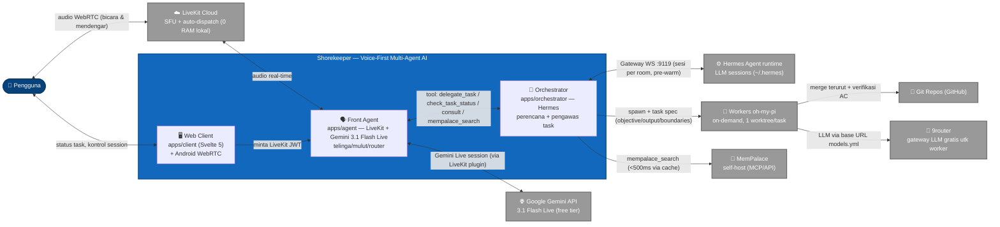
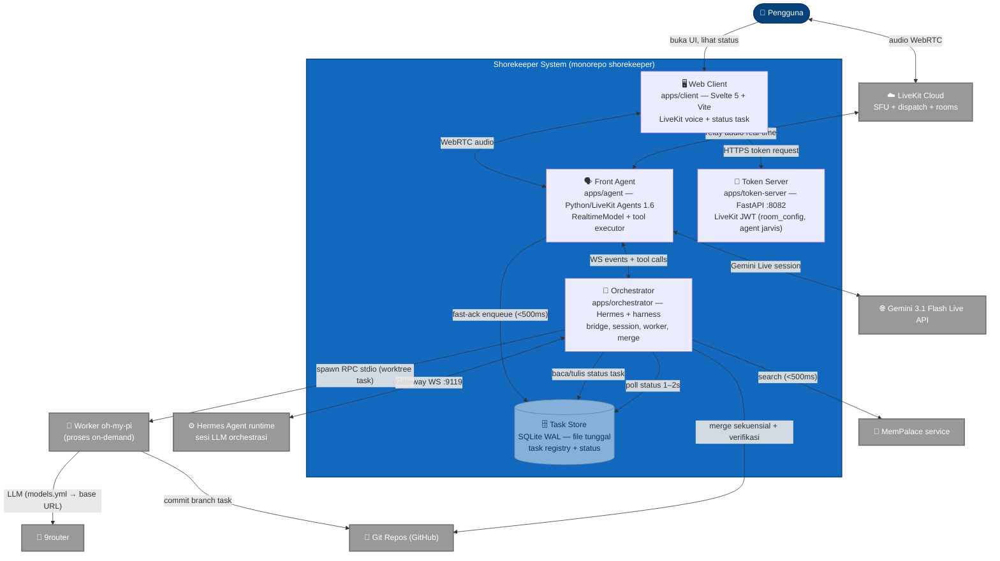
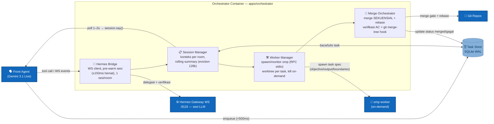
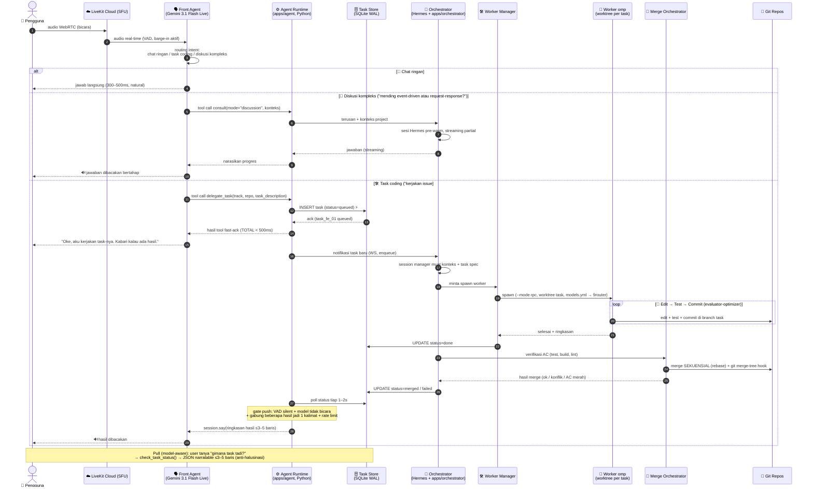
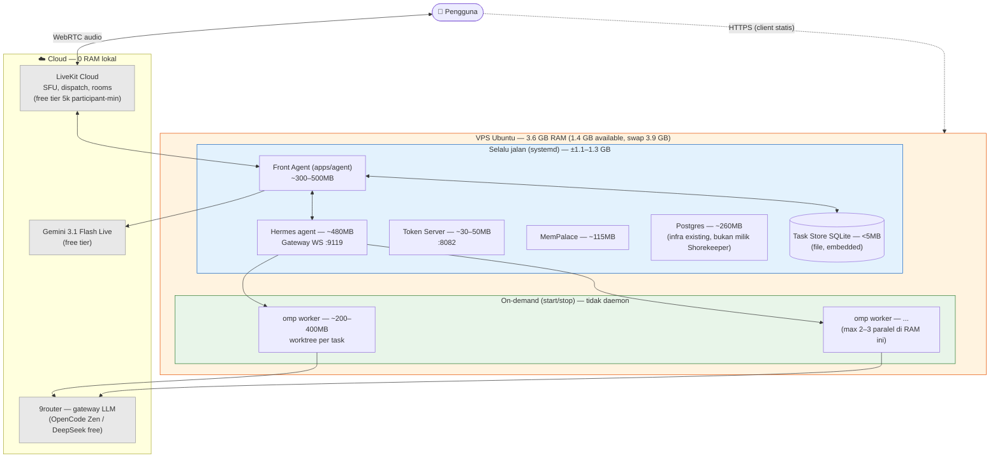

# ARCHITECTURE.md — Shorekeeper

**Voice-First Multi-Agent AI Assistant**

| | |
|---|---|
| **Status** | Draft v1 — untuk review |
| **Tanggal** | 17 Agustus 2026 |
| **Generasi arsitektur** | G3 — native realtime (supersedes G2 cascade Deepgram→Hermes→Fish) |
| **Pola inti** | Supervisor (LiveKit) + Orchestrator-Workers (Hermes → oh-my-pi) + Evaluator-Optimizer di worker |
| **Lokasi final** | `docs/architecture.md` pada monorepo shorekeeper (diagram mermaid versionable — disimpan sebagai kode, bukan gambar) |

> Dokumen ini mengikuti C4 model (Simon Brown) dan struktur per riset `riset-best-practice-dokumen-planning-ai-agent.md` §2 (ARCHITECTURE.md) serta `riset-project-structure-ai-agents.md` (monorepo & boundaries). Semua diagram = Mermaid; keputusan arsitektur tercatat sebagai ADR (Nygard template).

---

## 1. Ringkasan Eksekutif

Shorekeeper adalah asisten AI **voice-first multi-agent**: pengguna berbicara, dan perintah itu bisa menjadi percakapan ringan, task coding yang dikerjakan worker agent di repo, atau diskusi kompleks yang diteruskan ke "otak" (Hermes + MemPalace).

**Formulasi satu kalimat:** *suara masuk ke Front Agent (Gemini 3.1 Flash Live) → intent dirutekan → task di-delegate secara **fast-ack** ke Hermes orchestrator → worker oh-my-pi mengerjakan di worktree terisolasi → merge **sekuensial** terverifikasi → hasil dibacakan kembali ke pengguna.*

Prinsip arsitektur (locked):

1. **Fast voice, smart brain** — model live yang cepat (300–500ms, barge-in native) memimpin percakapan; semua *reasoning* berat di-delegate ke backend. Front = telinga/mulut/ROUTER, **bukan** otak.
2. **Supervisor, bukan handoff** — satu front agent permanen; sub-agent adalah sesi Hermes eksternal yang dipanggil lewat tools (mid-session handoff **rusak** di Gemini 3.1: `update_agent()`/`send_realtime_input()` ditolak error 1007).
3. **Delegation = fast-ack async** — tool TIDAK pernah menunggu pekerjaan selesai. `delegate_task()` enqueue dalam <500ms dengan jawaban `"task_fe_01 queued"`; kerja berat berjalan di background; hasil dikirim via **pull** (`check_task_status`) + **push** (`session.say()` polling task store).
4. **Sekuensial secara default** — paralel HANYA untuk task yang benar-benar independen (konflik PR paralel 27.67%, AIDev-pop; 2 agent kolaborasi −30% success). Merge terurut + rebase, max 3–5 agent aktif.
5. **Gratis end-to-end ($0)** — semua komponen free-tier atau self-host open source; RAM VPS (3.6GB) adalah constraint paling nyata.
6. **State di SQLite, artifacts di filesystem** — task store SQLite WAL (1 file, <1ms, single-writer), output worker besar ditulis ke filesystem lalu dirujuk ringan (hindari "game of telephone" antar agent).

---

## 2. Constraints & Asumsi (locked)

| Constraint | Nilai | Catatan |
|---|---|---|
| Biaya | **$0/langganan** | LiveKit Cloud Build free (5.000 participant-min + 1.000 agent-min/bln, hard cap), Gemini 3.1 Flash Live free tier, self-host. Paywall traps: Gemini grounding search $14/1k setelah 5k gratis; OpenHands Cloud berbayar; Hatchet Cloud berbayar. |
| RAM VPS | **3.6 GB total, ~1.4 GB available** (swap 3.9GB) | Hermes ~480MB, Postgres ~260MB, MemPalace ~115MB, token server ~30–50MB, front agent ~300–500MB → omp worker TIDAK bisa selalu jalan (on-demand, 200–400MB/sesi) |
| Latency voice (target riset) | **p95 first-token < 1.5s**; turn chat p50 600–900ms | Front model native realtime 300–500ms; narasi delegasi menaikkan toleransi user ke 2–3s |
| Front model | **Gemini 3.1 Flash Live** (`gemini-3.1-flash-live-preview`) | ComplexFuncBench Audio 90.8%; tool calling **sync-only** (async tools `WHEN_IDLE` adalah fitur 2.5, tidak ada di 3.1) |
| Konteks front | 128k + `contextWindowCompression` bawaan | Eviction membuat model "lupa" → kompensasi rolling summary dari backend |
| Integrasi eksternal | Hermes, MemPalace, oh-my-pi, LiveKit Cloud, 9router **tetap layanan terpisah** | Hanya diintegrasi via API/tool/MCP — tidak di-rewrite ke monorepo |
| Keamanan boundary | Worker tidak pernah push ke main tanpa AC hijau; tidak pernah akses kredensial; tidak pernah edit di luar repo target | Hard prohibition — safety control utama |

**Asumsi:** 1 pengguna (personal, bukan multi-tenant); VPS tunggal Ubuntu; bahasa percakapan utama Indonesia (audio quality Indonesia adalah dimensi evaluasi); repositori Git di GitHub.

---

## 3. Level 1 — System Context (C4)

```
┌─────────────────────────────────────────────────────────────┐
│  Sistem Shorekeeper                                          │
│                                                              │
│  Front Agent ──► Orchestrator ──► Workers oh-my-pi           │
│  (mulut/telinga)   (otak: Hermes)    (tangan: coding)        │
└─────────────────────────────────────────────────────────────┘
```



**Elemen kunci:**

| Elemen | Deskripsi |
|---|---|
| **Pengguna** | Satu personal user; bicara via browser (Svelte client) atau Android (native hardware WebRTC audio); interupsi/barge-in kapan saja |
| **Front Agent** | LiveKit Agents 1.6 + `google.realtime.RealtimeModel` (Gemini 3.1 Flash Live). Menangkap intent, routing, menjaga percakapan. Sadar diri: mengakui batas & mengalihkan ke Hermes secara verbal, tetap natural. |
| **Orchestrator** | Hermes (agent runtime) + `apps/orchestrator` (harness: bridge, session manager, task store, worker manager, merge orchestrator). Satu-satunya pemanggil workers. |
| **Workers oh-my-pi** | Harness coding standalone (MIT, Rust core + Bun): task agent dengan isolated worktree (filesystem clone), model-agnostic via 9router. Di-spawn on-demand, di-kill setelah selesai. |
| **MemPalace** | Memori jangka panjang self-host; diakses on-demand lewat tool (<500ms, cache lokal — tidak pernah KG sinkron per-turn). |
| **Git Repos** | Tempat kerja workers; branch per task; merge dikendalikan orchestrator (bukan worker). |
| **9router** | Router LLM gratis (OpenCode Zen free, DeepSeek via aeter) untuk model worker. |

---

## 4. Level 2 — Container (C4)



**Detail container:**

| Container | Teknologi | Tanggung jawab | Boundary |
|---|---|---|---|
| **Web Client** (`apps/client`) | Svelte 5 + Vite (Bun) | UI status task, livekit-voice.ts (wakeword, streaming markdown, stores session), kontrol session | Hanya consume; tidak pernah menulis task store langsung |
| **Front Agent** (`apps/agent`) | Python, LiveKit Agents 1.6, `google.realtime.RealtimeModel` | Session voice real-time; routing intent; eksekusi tool (delegate_task, check_task_status, consult, mempalace_search); polling task store → `session.say()` push; filler/narasi | TIDAK pernah: reasoning dalam, edit repo, commit. Hanya router + eksekutor tool tipis |
| **Orchestrator** (`apps/orchestrator`) | Hermes agent + harness Python | Terima task; pecah jadi tasks; spawn workers; verifikasi AC; merge gate; lapor hasil. Komponen internal: lihat §5 | Satu-satunya pemanggil worker; TIDAK commit langsung ke repo worker |
| **Token Server** (`apps/token-server`) | FastAPI (Python), port 8082 | Terbitkan LiveKit JWT (room_config, dispatch agent `jarvis`) | Stateless; secret API key hanya di sini |
| **Task Store** | SQLite **WAL mode**, 1 file | Registry task durable: id, track, status (queued→running→done/merged/failed), ringkasan, artifact refs, env+prompt_version | Single-writer (front agent); artifacts besar → filesystem, bukan DB |
| **Worker oh-my-pi** | Rust core + Bun (proses on-demand) | Edit → test → commit dalam worktree per task (isolated via filesystem clone) | Tidak pernah push ke main; tidak pernah keluar repo target |
| **MemPalace** | Self-host service + MCP | Memori jangka panjang; jawab `mempalace_search` <500ms via cache | Read-only dari agent (write via pipeline terpisah) |

---

## 5. Level 3 — Component (Orchestrator)

Komponen di dalam container **Orchestrator** (`apps/orchestrator`). Hermes Agent runtime adalah *engine LLM* yang di-drive harness ini via Hermes Gateway WS.



| Komponen | Tanggung jawab | Error handling |
|---|---|---|
| **Hermes Bridge** | Koneksi WS persist ke Hermes Gateway (`ws://127.0.0.1:9119/api/ws`); pre-warm sesi saat room mulai; streaming partial jawaban konsultasi | Reconnect eksponensial; sesi mati → task store status `failed_reconnect`, push notify |
| **Session Manager** | Satu sesi Hermes per room; compile konteks (SOUL.md → 4-section instructions, env, prompt_version); rolling summary saat contextWindowCompression menendang | Konteks evicted → ringkasan di-serve ulang dari rolling summary |
| **Task Store** | Registry task (SQLite WAL); CRUD status; audit env+version per task; query untuk polling & laporan | WAL checkpoint terjadwal; corrupt → file baru + log (data ringan, aman hilang) |
| **Worker Manager** | Spawn omp (`--mode rpc`, NDJSON); inject task spec + model config dari `~/.omp/agent/models.yml`; monitor token/durasi; kill saat runaway/threshold | Runaway timeout → kill + status `failed` + lapor; retry 3x untuk test merah sebelum escalate |
| **Merge Orchestrator** | Merge **berurutan** berdasarkan ketergantungan task; `git merge-tree` hook untuk deteksi konflik dini; verifikasi AC (unit test, build, lint) sebelum merge; squash atau rebase per policy repo | Konflik → task dikembalikan ke worker untuk resolve (tidak pernah auto-resolve); AC merah → merge dibatalkan + notify |

---

## 6. Sequence Diagram — Voice Pipeline (end-to-end)

Alur inti: **voice → intent → delegate → worker → merge → notify**.



**Catatan penting (G3.1 verified):**
- `send_realtime_input` / `generate_reply()` / `update_instructions()` **mati** di Gemini 3.1 (error 1007 setelah turn 1, `mutable_chat_context/instructions=False` di plugin LiveKit) → jalur hasil hanya **pull** (check_task_status) + **push programmatic** (polling → `session.say()`; model buta terhadap isi, user mendengar).
- Tidak ada interim transcript di mode realtime → subtitle butuh STT terpisah (opsional, di luar path inti).
- Narasi delegasi ("aku kerjakan...") menaikkan toleransi jeda user ke ~2–3s — ini fitur desain, bukan workaround.

---

## 7. Data Flow & Latency Budget

### 7.1 Budget per tahap (jalur realtime — turn chat & narasi delegasi)

| # | Tahap | p50 | p95 | Catatan |
|---|---|---|---|---|
| 1 | Capture audio device → encode | ~10–20ms | ~40ms | Native hardware WebRTC (Android), hindari webAudioMix (crackle) |
| 2 | Uplink WebRTC → LiveKit SFU (cloud) | ~25–50ms | ~100ms | Tergantung region; LiveKit Cloud |
| 3 | SFU → Gemini Live (VAD + model) | ~50–100ms | ~200ms | VAD min_silence 0.4s, TurnDetector 0.5–2.5s |
| 4 | **Gemini 3.1 Flash Live — first audio token** | **~450ms** | **~800ms** | Native realtime 300–500ms; reasoning di-loop tetap di front? Tidak — routing saja |
| 5 | Eksekusi tool (fast-ack): tulis SQLite + enqueue | ~50–150ms | **<500ms** | Target keras: tool TIDAK pernah menunggu kerja berat |
| 6 | Narasi konfirmasi delegasi (bagian turn 4) | 0 (paralel) | — | "Oke, aku kerjakan..." — toleransi user 2–3s |
| 7 | `mempalace_search` (saat butuh memori) | <300ms | <500ms | Wajib cache lokal; JANGAN KG sinkron per-turn |
| 8 | `consult` diskusi → Hermes first-token | ~1.3–1.8s (baseline terukur) | ≤2.5s | Pre-warm sesi hemat ±150ms; streaming partial |

**✓ Target turn sederhana (chat):** p50 **600–900ms**, p95 **< 1.5s** (first-token) — memenuhi riset "P95 first-token response < 1.5s".

### 7.2 Budget jalur task (non-realtime — background)

| Tahap | Durasi target | Catatan |
|---|---|---|
| Enqueue + ack ke user | **< 500ms** | Fast-ack; user sudah dengar konfirmasi |
| Spawn worker (omp, worktree clone) | ~1–3s | Filesystem clone lebih cepat dari git worktree |
| Eksekusi task (edit→test→commit) | detik – menit | Tergantung kompleksitas; token & durasi threshold untuk runaway |
| Merge sekuensial + verifikasi AC | ~5–30s | Gate: test hijau + build + lint; konflik → kembali ke worker |
| **Notify hasil (done → user dengar)** | **≤ 2.5s** | Poll 1–2s + gate VAD + session.say(); gabung multi-hasil jadi 1 kalimat |

### 7.3 Bentuk data antar komponen

| Aliran | Kontrak | Ukuran target |
|---|---|---|
| Front → Task Store (enqueue) | `task.schema.json` (contracts) | <1KB |
| Front ↔ Orchestrator (events) | `agent-event.schema.json` (WS) | <4KB |
| Front → Token Server | `token-request.schema.json` | <0.5KB |
| Orchestrator → Worker (task spec) | Objective 1 kalimat + Context (path nyata) + Requirements bernomor + AC testable + Out of Scope + Notes, JSON/NDJSON | ≤2KB |
| Worker → Orchestrator (hasil) | Ringkasan + artifact refs (filesystem), BUKAN salinan output besar | ≤1KB + refs |
| `check_task_status` → front | JSON narratable | **3–5 baris** (anti-halusinasi narasi) |
| `session.say()` push | Teks ringkas (formatted for TTS) | 1–2 kalimat |

---

## 8. Tech Stack

| Layer | Teknologi | Versi | Peran |
|---|---|---|---|
| Voice runtime | **LiveKit Agents** (Python) | 1.6 | Room, dispatch, supervisor pattern, `AgentTask`, `userdata`, async tools (1.6 — tapi tidak untuk Gemini 3.1) |
| Front model | **Gemini 3.1 Flash Live** (`google.realtime.RealtimeModel`) | preview | Speech-to-speech, barge-in, routing intent, fast-ack tool calls. Free tier: 3 sesi concurrent/project |
| Orchestrator | **Hermes Agent** (Nous Research) | — | Otak: sesi per room via Gateway WS :9119; planning, delegation, verification |
| Orchestrator harness | Python + FastAPI/uvicorn | 3.12 | `apps/orchestrator`: bridge, session manager, worker manager, merge orchestrator |
| Worker harness | **oh-my-pi (omp)** — Rust core + Bun | ~25k★, MIT | `--mode rpc` (NDJSON), one-shot `-p`, Node SDK; isolated worktrees (filesystem clone) |
| Worker LLM | Model-agnostic via **9router** (`~/.omp/agent/models.yml`) | — | OpenCode Zen free / DeepSeek free (5 akun load-balanced) |
| Task store | **SQLite (WAL)** | 3.x | 1 file, <1ms write, single-writer = front agent; nol ops |
| Memori | **MemPalace** (self-host) | — | Memori jangka panjang via tool <500ms (cache) |
| Token server | FastAPI (Python) | :8082 | LiveKit JWT (room_config, dispatch agent `jarvis`) |
| Web client | **Svelte 5 + Vite** (Bun) | 5 | livekit-voice.ts, wakeword, stores session/conversation/tools/logs, StreamingMarkdown |
| Shared contracts | **JSON Schema versioned** + codegen | — | `task.schema.json`, `agent-event.schema.json`, `token-request.schema.json` → Pydantic (Python) / json2ts (TS); validasi jsonschema/ajv |
| Config | pydantic-settings (Py) / zod (TS) | — | 12-factor env; `.env` per app; `.env.example` di-commit, secret tidak |
| Testing | pytest + pytest-asyncio, LiveKit behavioral tests, vitest, Playwright | — | Piramida unit → integration → behavioral (turn-level, CI) → simulation e2e → human eval |
| CI | GitHub Actions | — | Per-path: `agent.yml`, `orchestrator.yml`, `client.yml`, `contracts.yml` (codegen determinism: `git diff --exit-code`) |
| Infra | Docker/docker-compose, systemd | — | VPS Ubuntu; service selalu-jalan vs on-demand |
| Source control | Git + **worktree per task** | — | Isolasi; merge sekuensial + rebase |

---

## 9. Keputusan Desain — ADR

Pola: satu file satu keputusan, lokasi `docs/adr/0001-<slug>.md`, immutable (amend = ADR baru / superseded). Template Nygard (Status / Context / Decision / Consequences — trade-off WAJIB).

| ADR | Keputusan | Status | Ringkasan trade-off |
|---|---|---|---|
| [0001-gemini-live-front](docs/adr/0001-gemini-live-front.md) | Front = **Gemini 3.1 Flash Live** (bukan pipeline STT-LLM-TTS, bukan 2.5) | Accepted 2026-08-17 | + natural latency 300–500ms, barge-in native, gratis; − vendor lock-in voice, tool-calling sync-only, tool set front dibatasi (routing tipis) |
| [0002-supervisor-pattern](docs/adr/0002-supervisor-pattern.md) | **Supervisor, bukan handoff** (mid-session handoff dead di 3.1: error 1007) | Accepted 2026-08-17 | + satu front permanen, sub-agent eksternal via tools; − kompleksitas state antar sesi dipindah ke task store |
| [0003-fast-ack-delegation](docs/adr/0003-fast-ack-delegation.md) | Tool **tidak pernah menunggu**; enqueue <500ms; hasil via pull (`check_task_status`) + push (`session.say()` polling) | Accepted 2026-08-17 | + responsivitas voice, toleransi jeda 2–3s; − front buta isi push (model tidak tahu apa yang dibacakan) |
| [0004-sqlite-task-store](docs/adr/0004-sqlite-task-store.md) | Task store = **SQLite WAL 1 file**, bukan Redis/Hatchet | Accepted 2026-08-17 | + <1ms, single-writer, nol ops, muat VPS; − tidak multi-host, Hatchet overlap dengan AgentTask → drop (hemat RAM) |
| [0005-oh-my-pi-worker](docs/adr/0005-oh-my-pi-worker.md) | Worker = **oh-my-pi (omp)**, bukan OpenHands/OMC/OmO | Accepted (sementara) 2026-08-17 | + standalone MIT, 3 entry headless, worktree matang, ringan (~200–400MB, on-demand); − capability autonomous coding masih perlu validasi |
| [0006-sequential-merge](docs/adr/0006-sequential-merge.md) | **Merge sekuensial** + rebase; paralel hanya untuk task independen; max 3–5 agent | Accepted 2026-08-17 | Konflik PR paralel 27.67% (AIDev-pop); 2 agent kolaborasi −30% success; + deterministik, − lebih lambat untuk workload paralel besar |
| [0007-monorepo-struktur](docs/adr/0007-monorepo-struktur.md) | **Monorepo** `apps/` + `packages/` (agent, orchestrator, token-server, client, contracts) | Accepted | + kontrak & perubahan atomic sekali commit, satu CI; − perlu disiplin boundary (uv tidak enforce isolasi member) |
| [0008-free-tier-budget](docs/adr/0008-free-tier-budget.md) | **$0 end-to-end**; LiveKit Cloud free, Gemini free, self-host; komponen berat on-demand | Accepted 2026-08-17 | + nol biaya; − hard cap free tier (session baru gagal saat kuota habis), RAM ketat 1.4GB available |
| [0009-mempalace-memory](docs/adr/0009-mempalace-memory.md) | Memori = MemPalace on-demand <500ms (cache); "otak di backend" | Accepted | + konteks front tetap ramping; − memori lambat = UX jelek → cache wajib |
| [0010-persona-compiler](docs/adr/0010-persona-compiler.md) | SOUL.md **dikompilasi** ke 4-section live instruction (persona → conversational rules → tools → guardrails), bukan paste raw | Accepted | + instruksi ringkas & efektif untuk voice; − perlu compiler + versi prompt (`prompt_version`) |

**ADR yang masih direncanakan (open):** observability (Langfuse self-host vs custom tracing), self-host LiveKit SFU sebagai fallback, session resumption pasca-reconnect detail.

---

## 10. Deployment View

### 10.1 Topologi



### 10.2 Service & port (VPS)

| Service | RAM (terukur) | Cara jalan | Port/URL |
|---|---|---|---|
| Hermes agent (orchestrator engine) | ~480MB | systemd `hermes` | Gateway WS `ws://127.0.0.1:9119/api/ws` |
| Front Agent (`apps/agent`) | ~300–500MB | systemd | Connect ke LiveKit Cloud (dispatch) |
| Token Server (`apps/token-server`) | ~30–50MB | systemd | HTTP `:8082` endpoint `/token` |
| Task Store (SQLite) | <5MB | embedded (front agent) | file `data/tasks.db` (WAL) |
| MemPalace | ~115MB | systemd/service | API lokal + MCP |
| Postgres | ~260MB | systemd (infra existing) | :5432 — **tidak dipakai** task store |
| omp workers | 200–400MB/sesi | **on-demand** (spawn/kill oleh Worker Manager) | RPC stdio (subprocess) |
| Web Client (`apps/client`) | statis | build Vite → serve (nginx/caddy) | :80/:443 |

**Env vars penting:** `LIVEKIT_URL` (cloud), `LIVEKIT_API_KEY/SECRET`, `GEMINI_API_KEY`, `HERMES_WS_URL=ws://127.0.0.1:9119/api/ws`, `TASK_DB_PATH`, `MEMPALACE_URL`, `ROUTER_BASE_URL` (9router), `OMP_MODELS` (`~/.omp/agent/models.yml`), `ENVIRONMENT`, `PROMPT_VERSION`.

**Aturan operasional:**
- Komponen berat (worker) **on-demand** — VPS 3.6GB tidak sanggup daemon omp (estimasi footprint total 5–8GB kalau semua selalu jalan → OOM). OpenHands (1–1.8GB/sesi) TIDAK muat — itulah salah satu alasan omp.
- Worker di-kill setelah merge selesai; Worktree di-clean.
- LiveKit container lokal `--dev` yang idle (`jarvis-livekit-livekit-1`, port 7880–7882) → **stop** (hemat 150–300MB); produksi pakai LiveKit Cloud.
- Free tier hard-cap: session baru GAGAL saat kuota habis (bukan overage) — monitoring kuota + fallback self-host SFU (ADR open).

### 10.3 Struktur monorepo (boundary)

```
shorekeeper/
├── apps/
│   ├── agent/            # Front Agent — LiveKit Agents (Python/uv), src-layout
│   ├── orchestrator/     # Hermes harness: bridge, session mgr, worker mgr, merge
│   ├── token-server/     # LiveKit JWT (FastAPI, :8082)
│   └── client/           # Svelte 5 + Vite (Bun)
├── packages/
│   └── contracts/        # JSON Schema versioned + codegen (Pydantic / json2ts)
├── docs/
│   ├── architecture.md   # ← dokumen ini
│   ├── adr/0001-*.md     # ADR (Nygard)
│   ├── golden-set/       # eval cases
│   └── runbooks/
├── plans/                # planning artifacts
├── AGENTS.md             # < 150 baris, hand-written
└── .github/workflows/    # CI per-path
```

**Hard boundaries (agent-readable, wajib di AGENTS.md):** Hermes, MemPalace, oh-my-pi, LiveKit Cloud = layanan eksternal (integrasi via API/tool, jangan di-rewrite); worker tidak push ke main tanpa AC hijau; front tidak pernah edit repo; secret tidak pernah di git.

---

## 11. Observability (ringkas)

- **Tracing penuh tanpa isi percakapan** (pola Anthropic): task id + durasi per tahap (enqueue, spawn, worker, merge, notify), tool-call sequence, decision path — untuk debug "user tidak menemukan info".
- Task store = audit trail alami (status + `env` + `prompt_version` per task) → evaluasi dev vs prod bisa dibedakan.
- Dashboard: task success rate, escalation rate, cost token, latency p50/p95, kuota free tier (LiveKit participant-min/agent-min).
- Kill switch: matikan polling push + reject `delegate_task` (satu flag env) — siapa: operator.
- Prompts & persona versioned (`prompt_version`) — perubahan = PR dengan diff eval.

---

## 12. Glossary & Open Questions

**Glossary:** *Front Agent* (mulut/telinga/router, model live) · *Orchestrator* (otak: Hermes + harness) · *Worker* (omp, tangan: eksekusi task di worktree) · *Fast-ack* (tool jawab <500ms lalu kerja background) · *Task Store* (registry task SQLite) · *Handoff* (serah terima konteks antar agent — di G3 via contract JSON, bukan session switch) · *Worktree* (isolasi filesystem per task) · *Rolling summary* (kompensasi eviction konteks 128k).

**Open questions:**
1. Kemampuan autonomous coding bawaan omp (task→edit→test→commit) — matang atau perlu dirangkai manual via prompt? (validasi POC)
2. `thinkingLevel` bisa diubah mid-session atau config-locked?
3. RAM riil omp worker di VPS — perlu `docker stats`/`free` aktual saat spawn.
4. Session resumption + task store survive reconnect — desain detail (riset edge cases belum disintesis).
5. Self-host LiveKit SFU sebagai fallback free tier habis — UDP port, TURN, resource.